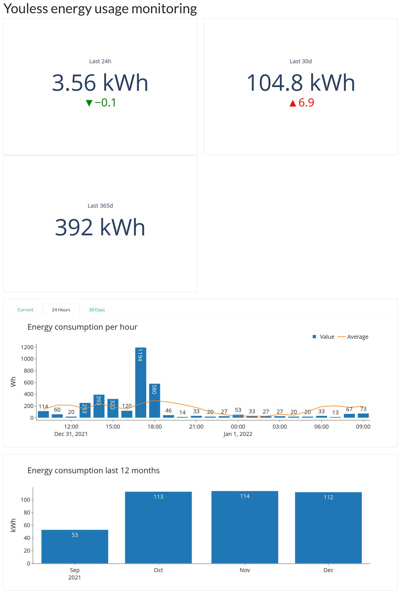

This repository contains 2 applications:
1. A script to extract data from the a youless logger
2. A dash-application which creates a dashboard to visualize the data

# Prerequisite 
In order to run this script and the app you need a Youless logger connected to the same network as the machine you run this script on.
We assume the logger is reachable on `http://youless/` via your browser.

# Logger
The python script `looger.py` in this repository extracts the logged data (hour, minute and daily data) from a Youless logger.
The data is stored in a SQLite database named `youless.db` with 3 tables set up:

- `youless_minute` for minute based energy consumption
- `youless_hour` for hourly energy consumption
- `youless_day` for daily energy consumptoin

# Dashboard
The dash application runs a dashboard to visualize the energy consumption.



# Setup

First you need to create a `config.json` file in the root of the repository. This file can have the following parameters:

```json
{
    "db_path": "/home/user/youless-logger/youless.db",
    "debug_mode": false
}
```

- `db_path`: Full path to the file which should store your data (file will be created automatically)
- `debug_mode`: Indicator whether the dash app should be ran in debug mode


## Script

You can run the logger script (`logger.py`) manually or set up a crontab to run it automatically.
This example sets it up to run every minute:

Edit your crontab

```bash
crontab -e
```

Enter the following line (adjust the path to the script):

```bash
* * * * * /path/to/your/python/env /full/path/to/logger.py
```
Example:
```bash
* * * * * /home/pi/.pyenv/versions/youless-logger/bin/python /home/pi/youless-logger/logger.py
```

Save it.

## Dashboard

You can run the dashboard script (`app.py`) manually or set up a crontab to run it automatically.
This example sets it up to run on startup:

Edit your crontab

```bash
crontab -e
```

Enter the following line (adjust the path to the script):

```bash
@reboot /path/to/your/python/env /full/path/to/app.py
```

Example:
```bash
@reboot /home/pi/.pyenv/versions/youless-logger/bin/python /home/pi/youless-logger/app.py
```

Save it.

Alternatively you can also use the provided `youless-app.service` file and run the application with systemd.
Make sure to adjust the `WorkingDirectory` and the `ExecStart` parameters correctly.

You should be able to access the app in your browser while you are in the same network via the devices IP address or host name.
For a standard raspberry pi you could reach it on

```
rasbperrypi:8050
```